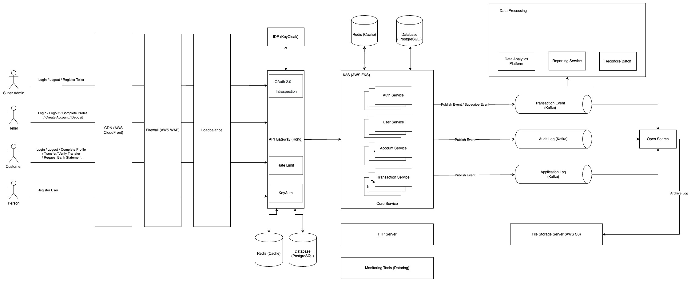

# Spring Boot Core Bank

## Overview
Spring Boot Core Bank is a core banking system built using Spring Boot, designed with an Event-Driven Architecture.  
It supports authentication, account management, transactions, and reporting functionalities while integrating with PostgreSQL, Kafka, and Kong API Gateway.

## Features

### Authentication & Authorization
- Supports JWT Authentication
- Implements Role-based Access Control (RBAC) (Super Admin, Teller, Customer, Person)
- Uses OAuth 2.0 with Keycloak for Single Sign-On (SSO) (not implemented yet)
- Secure endpoints using Spring Security

### Account Management
- Super Admin can register tellers
- Tellers can create accounts for customers
- Customers can manage their accounts after login

### Transactions
- Customers can transfer money between accounts with PIN verification
- Tellers can deposit money into customer accounts
- All transactions are logged and stored for reporting

### Event-Driven Architecture (not implemented yet)
- Transactions trigger Kafka events for processing
- Supports real-time reporting and reconciliation batch processing

### API Gateway & Security (not implemented yet)
- Kong API Gateway manages traffic and secures API endpoints
- Rate limiting and API authentication using Keycloak and JWT tokens

### Data Storage & Caching
- PostgreSQL for persistent data storage
- Redis for caching frequently accessed data
- AWS S3 for log and report storage (not implemented yet)

## Tech Stack

| Technology       | Description |
|-----------------|------------|
| Spring Boot     | Core framework for backend services |
| PostgreSQL      | Relational database for storing accounts & transactions |
| Kafka (not implemented yet) | Message queue for event-driven processing |
| Redis          | Caching layer for faster performance |
| Kong API Gateway (not implemented yet) | Secure API access with rate limiting and authentication |
| Keycloak (not implemented yet) | Identity provider for authentication & authorization |
| AWS S3 (not implemented yet) | File storage for logs and reports |

## System Architecture

Below is the high-level system architecture diagram:



### System Components:
1. Users  
   - Super Admin: Manages tellers  
   - Teller: Creates accounts, deposits money  
   - Customer: Transfers money, requests statements  

2. API Gateway (Kong) (not implemented yet)
   - Manages authentication & rate limiting
   - Routes API requests to backend services

3. Core Services
   - Auth Service: Handles user authentication & JWT tokens
   - User Service: Manages customer data & profiles
   - Account Service: Manages bank accounts
   - Transaction Service: Processes deposits, transfers, and generates transaction logs

4. Event Processing (not implemented yet)
   - Kafka: Handles transaction events for reporting & reconciliation
   - Reporting Service: Generates real-time transaction reports
   - Reconcile Batch: Ensures account balances match transactions

5. Data Storage
   - PostgreSQL: Stores customer, account, and transaction data
   - Redis: Caches frequently accessed data
   - AWS S3 (not implemented yet): Stores archived transaction logs

## Setup & Installation

### Prerequisites
- Java 17+
- Docker & Docker Compose
- PostgreSQL
- Redis
- (Kafka, Kong API Gateway, and Keycloak are planned but not implemented yet)

### Clone the Repository
```sh
git clone https://github.com/jirawatp/spring-boot-core-bank.git
cd spring-boot-core-bank
```

### Start Required Services (Docker)
To start PostgreSQL and Redis:
```sh
docker-compose up -d
```

### Build & Run the Application
```sh
mvn clean install
mvn spring-boot:run
```

### API Documentation (Swagger)
Once the application is running, visit:
```
http://localhost:8080/swagger-ui/index.html
```

## API Endpoints

### Authentication APIs
| Method | Endpoint | Description |
|--------|---------|-------------|
| POST   | /api/auth/register | Register a new user |
| POST   | /api/auth/login | Login and receive JWT token |
| POST   | /api/auth/logout | Logout user |

### Account Management APIs
| Method | Endpoint | Description |
|--------|---------|-------------|
| POST   | /api/account/create | Teller creates a new bank account |
| GET    | /api/account/me | Customer retrieves their account details |

### Transaction APIs
| Method | Endpoint | Description |
|--------|---------|-------------|
| POST   | /api/transaction/deposit | Teller deposits money |
| POST   | /api/transaction/transfer | Customer transfers money |
| POST   | /api/transaction/verify-transfer | Verify transfer before execution |
| POST   | /api/transaction/statement | Get bank statement for a given month |

## Environment Variables

| Variable Name | Description |
|--------------|-------------|
| SPRING_DATASOURCE_URL | PostgreSQL database URL |
| SPRING_DATASOURCE_USERNAME | PostgreSQL username |
| SPRING_DATASOURCE_PASSWORD | PostgreSQL password |
| KONG_ADMIN_URL (not implemented yet) | Kong API Gateway Admin URL |
| KEYCLOAK_URL (not implemented yet) | Keycloak Authentication Server URL |
| KAFKA_BROKER_URL (not implemented yet) | Kafka broker URL |
| REDIS_HOST | Redis server hostname |

## Monitoring & Logging

- (Future planned integrations with Datadog & OpenSearch)
- (Logs may be stored in AWS S3 in the future)

## Future Enhancements
- Implement GraphQL API for more efficient data retrieval
- Add Two-Factor Authentication (2FA)
- Improve Fraud Detection using machine learning
- Implement Automated KYC Verification for new customers
- Fully integrate Kafka, Kong API Gateway, and Keycloak
- Implement Service Tracing for better observability of requests across microservices
- Introduce Service Breaker (Circuit Breaker) to handle system failures gracefully

## Contributors
- Jirawat Pattanayutanachot (Owner)

## License
This project is No License.

## Contact
For any questions, feel free to contact:
- GitHub: [jirawatp](https://github.com/jirawatp)